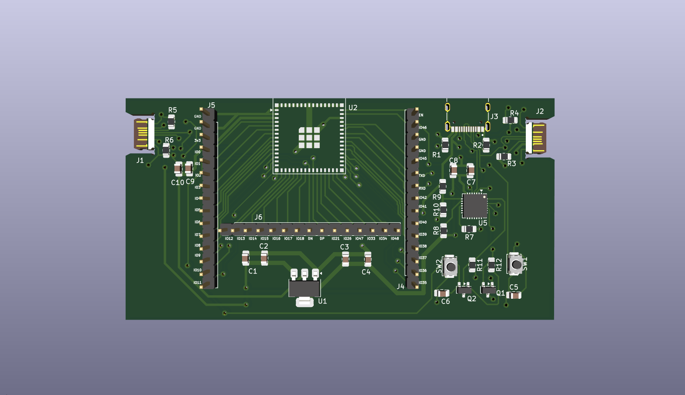
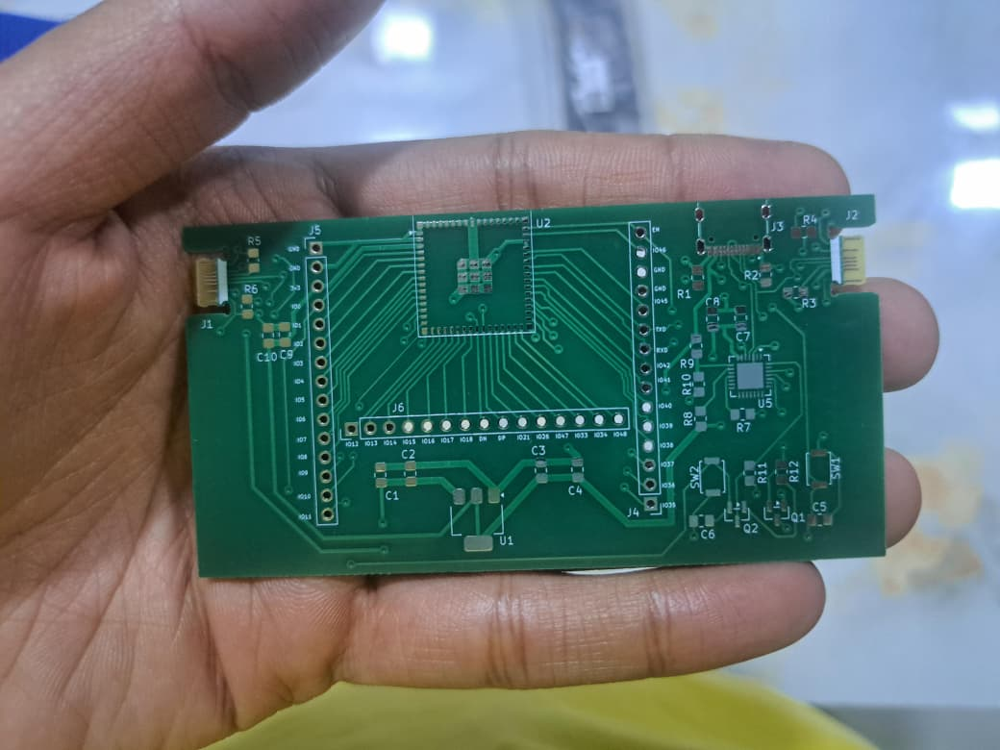

<h1 align="center">ESP32-C-edge</h1>

This project is a custom-designed ESP32-S3 development board created by me, featuring a USB Type-C edge connector directly integrated into the PCB. The board is intended to be compact, easy to manufacture, and convenient for prototyping without requiring a separate USB connector footprint.

---

## Overview

- MCU: **ESP32-S3**
- USB Interface: **USB Type-C via PCB edge connector**
- Purpose:
  - Minimal and compact ESP32-S3 dev board  
  - Direct USB connection without soldered connector  
  - Useful for experiments, prototypes, and small form-factor designs  
  - Learning project for PCB edge connectors and USB-C implementation  

---

## Features

- USB Type-C edge connector
- On-board ESP32-S3
- There are 3 USB Type-C in this design
    - Two on the right side are connected to a USB-TTL (CP2102).
    - One on the left is connected to D+ and D- pins of ESP32-S3.

---

## Results
|            3D-Viewer           |            Actual            |
| ------------------------------ | ---------------------------- |
|         |  |

---

## Tools Used

- PCB Design Software: KiCad
- MCU: ESP32-S3
- Fabrication: [JLCPCB](https://jlcpcb.com/)
- PCB-Thickness: 0.6 mm

---

## Future Work

- Improve the silkscreen of PCB.
- Change the corners of PCB.
- Try with 0.8 mm PCB thickness.

---

## Acknowledgement

Special thanks to [AnasMalas](https://github.com/AnasMalas) for publishing the USB Type-C edge connector design which made this project possible and [SRA-VJTI](https://github.com/SRA-VJTI) for providing the components, technical guidance, and hands-on support during the PCB design and development process.

